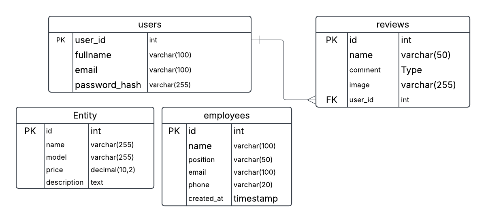

# Web-Programming-Project

## 🚗 Car-ing Website Project - Team 12

we have developed a website for car services.

# Database Table:

# Maha Marakkalage Rashmi Nawoda

1. Features : Added Login and Register pages with a new button
2. Database : Created User User Table
3. Form : Inquiry Form in Contact Us page |JavaScript Validations Applied And JavaScript event Handlers Applied

# SHUVOJYOTI SINGHA:

1. Php: Changed html & added multiple php files to use in reviews table and to logOut.
2. Added universal header and footer.
3. Feature: Showing Customer's review
4. Form: Review submit form in Home page.
5. Database: Created reviews table to take the input(name, reviews) of logged in users.
6. CRUD: Logged in user can create, read, update and delete their reviews.
7. Php handlers to handle review submission and fetching reviews and for loggedIn sessions.
8. Javascript: Event handler delete confirmation, validation blank reviews are not taken.

# Harsh Chahal

## **Functionality**

1. **Car Price Filter**: Users can select a price range.
2. **AJAX-Based Dynamic Listing**:
   - Cars are dynamically fetched and displayed **without refreshing the page** using AJAX.
   - The filtering process is handled by **`fetch_cars.php`** which returns JSON data.
3. **Traditional Listing**:
   - If JavaScript isn't used, cars are displayed on **`car_listing.php`** using PHP and MySQL queries.

## **Database Information**

- **Database Name**: `car_listings`
- **Table Name**: `cars`
- **Table Structure**:
  - `id` (INT, Auto Increment, Primary Key)
  - `name` (VARCHAR)
  - `model` (VARCHAR)
  - `price` (DECIMAL)
  - `description` (TEXT)

## **How It Works**

1. **User selects a price range** in `car_listing.php`.
2. **AJAX sends the request** to `fetch_cars.php` without reloading the page.
3. **`fetch_cars.php` returns JSON data**, and JavaScript updates the car listings dynamically.
4. **If AJAX is not supported**, `car_listing.php` falls back to the traditional PHP-based filtering.

# Sadia Rumpa|

1.  aboutUs.php added.
2.  Table: employees table.
3.  User can input team member name, email, designation and phone number
